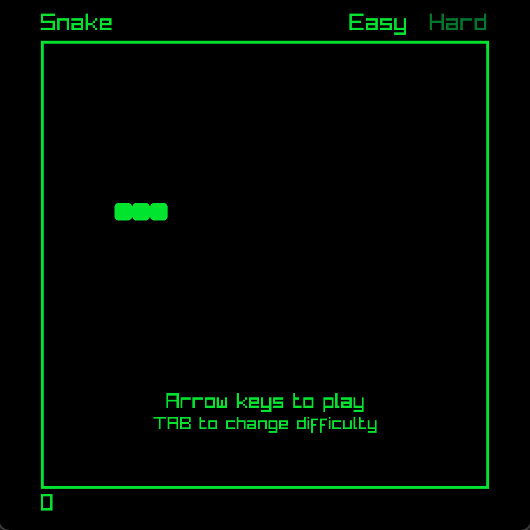
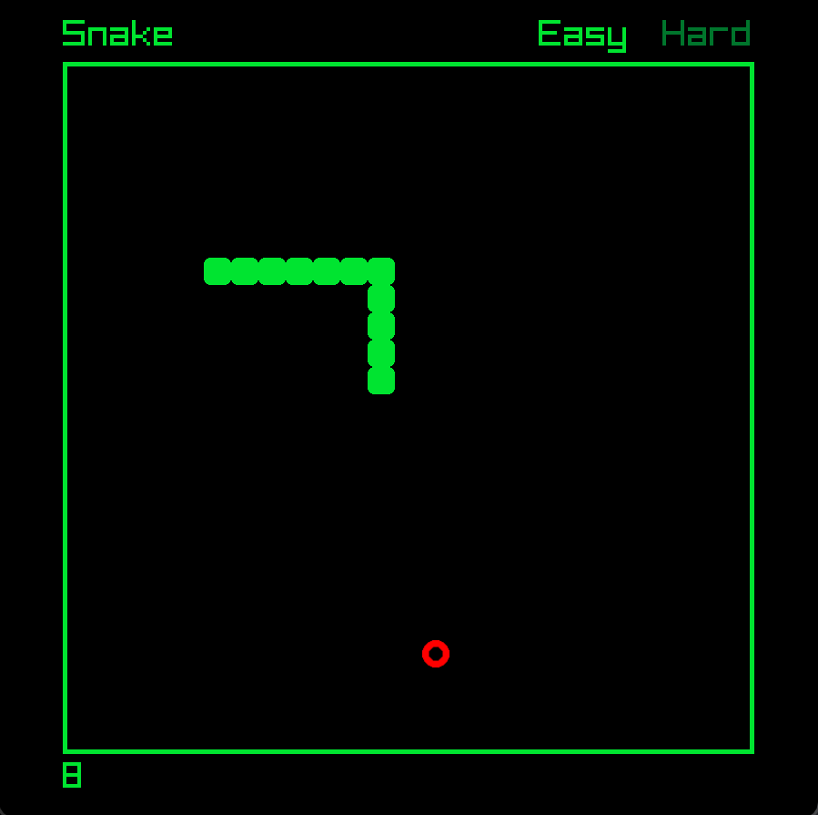
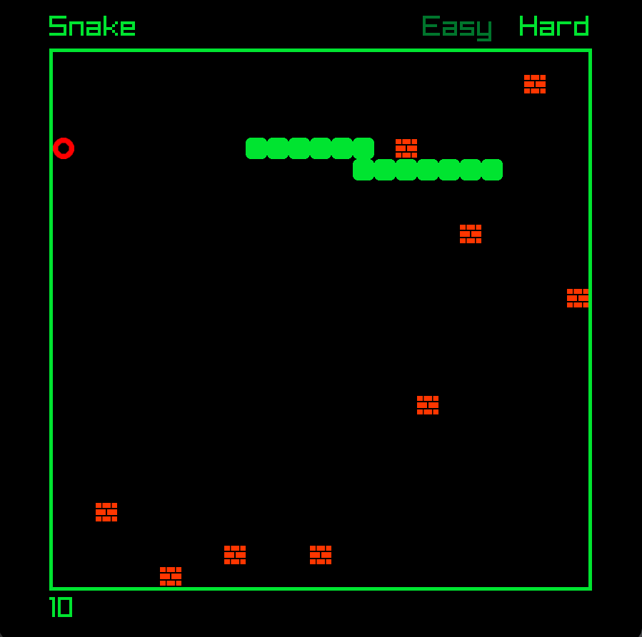
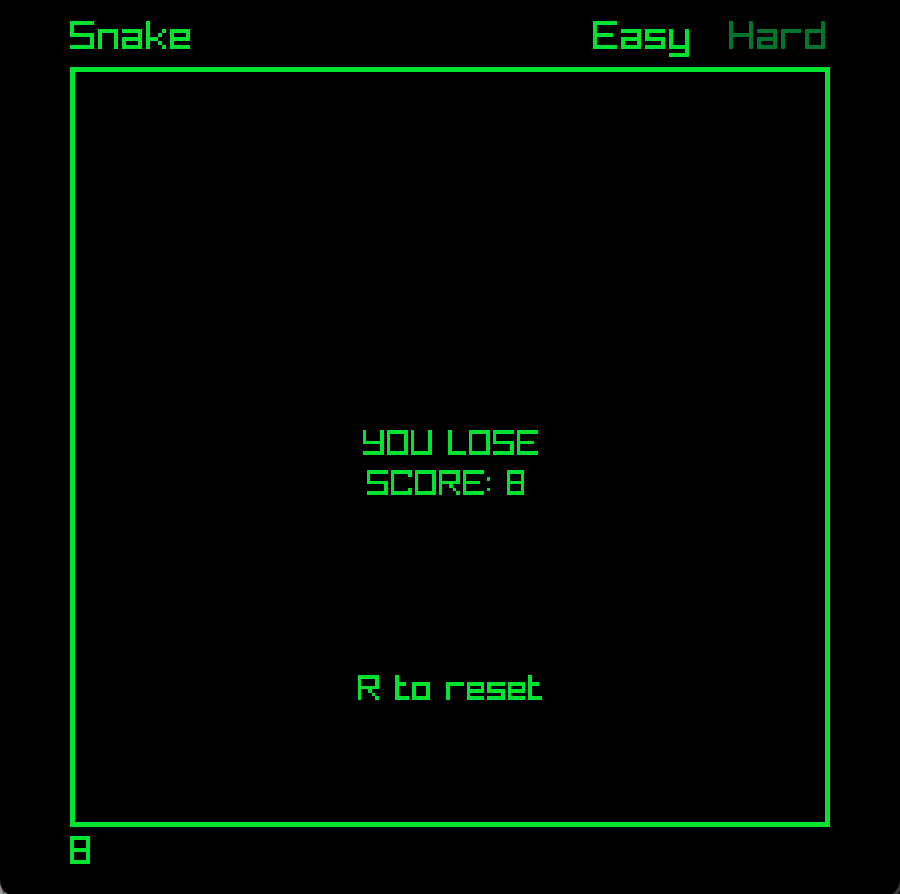

# raylib-snake
Basic snake game made with raylib and C++

## Features
- Easy difficulty: standard snake gameplay
- Hard difficulty: creates an obstacle for each point scored

## Images

  
  
  
  

